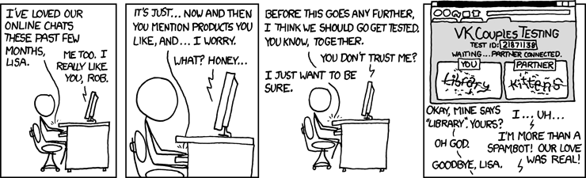

```{r setup, include=FALSE}
knitr::opts_chunk$set(echo = TRUE, warning = FALSE, message = FALSE)
```

In the [webscraping](webscraping.html) and [Twitter API](twitter-api.html) tutorials, we worked with texts that are already stored in digital form, so that getting them into `R` is just a matter of removing all the HTML code. But other texts (*lots* of texts) are not so digitally accessible. Maybe you're interested in historical archives living in a dark basement. Or old press releases living in a PDF. In either case, we need a method that can recognize text in *images*, and convert it into plaintext. This is a job for Optical Character Recognition (OCR).

## Optical Character Recognition

OCR is a notoriously difficult task for computers, which is why the "are you a human" tests on some websites might ask you to type a bunch of numbers and letters within a blurry or distorted image.

[](https://xkcd.com/632/)

But if the text is in straight lines on a white background, off-the-shelf OCR packages do a pretty good job. The workhorse OCR engine is called [Tesseract](https://en.wikipedia.org/wiki/Tesseract_(software)), and it's available in `R` through a package called `tesseract`.[^1]

[^1]: As of May 2022, `tesseract` doesn't play nicely with version 4.2.0 of `R`, so you'll want one of the 4.1 versions.

Let's see if it can recognize the text in that xkcd comic above, using the `ocr()` function.

```{r}
library(tesseract)

xkcd <- ocr(image = 'img/suspicion.png')

xkcd
```

Clearly it cannot make out "Library" and "Kittens", but by my count it reads about 65% of these handwritten words correctly. They're not in the right order though. Tesseract reads from left to right, top to bottom, and does not understand things like comic panels or speech bubbles. If we're just using a bag of words representation and we don't care about word order, then we can use the `ocr_data()` function, which splits the input into a dataframe with one row for each word. It even includes a handy `confidence` column, which tells you how confident the model is in its prediction.

```{r}
xkcd <- ocr_data(image = 'img/suspicion.png')

head(xkcd)
```

But if we *do* care about word order, then we'll need to be more careful about pre-processing the image before conducting OCR. For example, let's try to read in the text on page 3 of [this document](img/SOJ.pdf) about the California Supreme Court. The `pdftools` package can convert the page to an image, when we can then OCR.

```{r, cache=TRUE}
library(pdftools)

pdf_convert('img/SOJ.pdf', pages = 3, dpi = 600, filenames = 'img/SOJ.png')

text <- ocr('img/SOJ.png')

text
```

Notice two things. First, `ocr()` performs much better with the typed text than it did with the handwritten comic. Second, all the words are out of order, because it reads left to right across the two columns on that page. So we need to first crop the image into two columns and read each column separately. 

For that, we'll turn to the `magick` package.

## Image Pre-Processing

```{r}
library(magick)

# First, read in the image with magick
page3 <- image_read('img/SOJ.png')
page3

# Next, crop it into two images with image_crop()
# syntax is width x height + left offset + top offset
page3_left <- image_crop(page3, '2550 x 4300 + 0 + 1000')
page3_left

page3_right <- image_crop(page3, '2550 x 5000 + 2550 + 1000')
page3_right

# Finally, ocr() each column, then paste the results together
text_left <- ocr(page3_left)
text_right <- ocr(page3_right)

text <- paste(text_left, text_right)

text
```

## Practice Problems

1.  OCR the text on page 4 of [SOJ.pdf](img/SOJ.pdf).

2.  OCR the text in this [newspaper clipping](img/titanic.png) about the sinking of the Titanic.

## Further Reading

-   For more `tesseract` features, see this [vignette](https://cran.r-project.org/web/packages/tesseract/vignettes/intro.html)

-   State of the art optical character recognition uses advances in convolutional neural networks to handle handwritten and other kinds of difficult-to-read texts. See @torres2021 for a primer.
