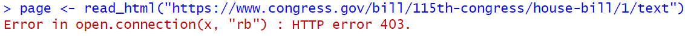

```{r setup, include=FALSE}
knitr::opts_chunk$set(echo = TRUE, warning = FALSE, message = FALSE)
library(tidyverse)
```

In the [webscraping tutorial](webscraping.html), we harvested text directly from the HTML code of a webpage. This can be pretty laborious, so fortunately, some websites provide an easier path to collecting their data, called an Application Programming Interface (API). Generally, when an API is available, using it is the easiest and [most polite](https://joeornstein.github.io/text-as-data/webscraping.html#being-polite) way to harvest your text data. On this page, we'll introduce ourselves to APIs by collecting bill text from the US Congress and video transcripts from YouTube.

## Congress API

Suppose we wanted to collect the full text of bills introduced in the US Congress. As a running example, let's try to load the text of "The Tax Cuts and Jobs Act" (HR 1, 115th Congress), which you can find [here](https://www.congress.gov/bill/115th-congress/house-bill/1/text). Although we can access that page through our web browser, if I try to read the HTML in `R`...

```{r, eval = FALSE}
library(tidyverse)
library(rvest)

page <- read_html("https://www.congress.gov/bill/115th-congress/house-bill/1/text")
```



...I get a foreboding "HTTP Error 403 - Forbidden" message. It turns out the US Federal Government does not take kindly to bots scraping their webpages.

Fortunately, the good people at congress.gov provide an API that we can use instead. An API endpoint is, in essence, a special web address that returns data instead of a webpage. For congress.gov, these web addresses all begin with `https://api.congress.gov/v3/`. But to access them, we'll need an **API key**, a unique password that identifies each user. You can sign up for one at the top of the [documentation page](https://gpo.congress.gov/).

Once you have your API key, you will include it as part of the web address you use to access information. Per the [API documentation](https://gpo.congress.gov/#/bill/bill_text), you can retrieve the text of bills with a web address in the following format:

```
https://api.congress.gov/v3/bill/{congress}/{billType}/{billNumber}/text?api_key={INSERT_KEY}
```

Wherever you see curly braces {}, replace them with values for the bill you want. In our example, those values will be `{congress} = 115`, `{billType} = hr`, and `{billNumber} = 1`. Rather than accessing this web address through the browser, we will ask `R` to read the data from the API endpoint directly.

### Step 1: Keep Your API Key Safe

You will be tempted to copy-paste your API key directly into your `R` script. Avoid this temptation. It's best practice to keep things like passwords and API keys saved in a separate location, not hard-coded into your scripts. That way, if you share your code (like I'm doing now), you don't accidentally reveal your secrets. I'm keeping my API key in a text file called `congress-api-key.txt`. The first step is to read it into memory.

```{r}
api_key <- read_file('congress-api-key.txt')
```

### Step 2: Get the data from the API

Next, we'll use the `glue` package to format web addresses:

```{r}
library(glue)

congress <- 115
billType <- 'hr'
billNumber <- 1

# glue() uses curly braces when inserting variable names
glue('/bill/{congress}/{billType}/{billNumber}/text')

url <- glue('https://api.congress.gov/v3/bill/{congress}/{billType}/{billNumber}/text?api_key={api_key}')
```

Once we've formatted the web address, we can use the `httr` package to get data from the API.

```{r}
library(httr)
d <- GET(url)
```

### Step 3: Convert to content from JSON to an R object

The object `d` is a JSON object. If you don't know what a JSON object is, not to worry! We can just use the `jsonlite` package to convert it into an `R` object.

```{r}
library(jsonlite)

# take the content attribute from d
content <- d$content |>
  # convert from unicode to English characters
  rawToChar() |>
  # convert the JSON format to an R object
  fromJSON()
```

Now we have an `R` object (a list) called `content`. Sadly, this is not yet the content we want. The wrinkle here is that there are 8 versions of the text of this bill, beginning with the first version that was introduced in the House and ending with the final version that was signed into law. The `content$textVersions` object tells us where to find the full text of each version. 

```{r}
content$textVersions
```

### Step 4: Get The Bill Text

Let's get the text for the latest version of the bill (the version that became law).

```{r}
mostRecent <- content$textVersions |> 
  # keep the row with the most recent date
  slice_max(date, n = 1) |> 
  # pull the formats column
  pull(formats)

mostRecent

# get the URL for the most recent Formatted Text
textURL <- mostRecent[[1]] |> 
  filter(type == 'Formatted Text') |> 
  pull(url)

# read the text
text <- read_file(textURL)
```

Finally! The object `text` contains the entire text of the bill. Printing this in its entirety would be too long, but here's a snippet:

```{r}
text |> 
  substr(1,1000) |> 
  cat()
```

### Putting Steps 1 through 4 into a function

Steps 1 through 4 make up the entire workflow for retrieving the text of a bill from the congress.gov API. If we ever plan to use that workflow again, it would be wise to encode it as a **function**. That way we're not copy-pasting large blocks of code every time we want to get the text of a new bill. Let's create a new function called `get_bill_text()`. This function will take as inputs the `congress`, `billType` and `billNumber` of a bill, complete Steps 1-4, and return the full text of the bill we want.

```{r}
get_bill_text <- function(congress, billType, billNumber){
  
  # Step 1: Get the API Key
  api_key <- read_file('congress-api-key.txt')
  
  # Step 2: Read the data from the API
  url <- glue('https://api.congress.gov/v3/bill/{congress}/{billType}/{billNumber}/text?api_key={api_key}')
  
  d <- GET(url)
  
  # Step 3: Convert the JSON object to an R list
  content <- d$content |>
    rawToChar() |>
    fromJSON()
  
  # Step 4: Get the most recent bill text
  mostRecent <- content$textVersions |>
    slice_max(date, n = 1) |>
    pull(formats)

  textURL <- mostRecent[[1]] |> 
    filter(type == 'Formatted Text') |> 
    pull(url)

  text <- read_file(textURL)
  
  # Return the text object
  return(text)
}
```

Does the function work? If so, it should get the same text object we created before:

```{r}
text == get_bill_text(congress = 115, billType = 'hr', billNumber = 1)
```

Play with the function a bit, changing the inputs to make sure that it returns the correct text when you ask for a different bill. And see the practice problems at the end of the page to get more practice working with the congress.gov API.

## YouTube API

In this next tutorial, we'll see how to retrieve YouTube video transcripts using its API and the [youtube-transcript-api](https://pypi.org/project/youtube-transcript-api/) Python module. This Python module allows us to avoid all tedious the work we did formatting web addresses for the congress.gov API. We just need a way to run Python modules from `R`. Fortunately, the `reticulate` package does just that.

### How to Drive Python from RStudio

For `R` users, the [`reticulate`](https://rstudio.github.io/reticulate/) package is a convenient way to run Python code and return outputs as `R` objects. The setup will be a little bit different depending on whether you're working with a PC or Mac.

#### Windows PC Setup

If you're on a Windows machine, first install the `reticulate` package through the R console, then install a version of Python, using the following two lines of code:

```{r, echo = TRUE, eval = FALSE}
install.packages('reticulate')
reticulate::install_miniconda()
```

#### Mac Setup

If you are a Mac user, you should follow the instructions for Windows PCs above, but then you're going to create a Python "virtual environment", using the following command in the R console.

```{r, eval=FALSE}
reticulate::conda_create('myenv')
```

Next, restart your R session. Then enter the following command to use the virtual environment you just created.

```{r, eval = FALSE}
reticulate::use_condaenv('myenv')
```

#### Install the Python package

Regardless of your operating system, you'll now want to install the `youtube-transcript-api` Python module, using the following function from `reticulate`.

```{r, eval=FALSE}
reticulate::py_install('youtube-transcript-api')
```

Setup is done! Let's play.

### Step 1: Get the video ID

Suppose we want the transcript of this YouTube video:

```{r, echo = FALSE}
knitr::include_url('https://www.youtube.com/embed/mLyOj_QD4a4?si=K6GPbav85zny_OeB')
```

You can click the CC button in the bottom right of the video to see YouTube's auto-generated transcript. Note that the quality of these transcripts can vary significantly, depending on the quality of the audio. 

To get the transcript using `R`, we'll need the video ID, which you can find at the end of the video's URL (the bolded text here):

https://www.youtube.com/watch?v=**mLyOj_QD4a4**

### Step 2: Create a Python object

Next, we'll *import* the Python module, creating an object called `youtubecaption`.

```{r}
youtubecaption <- reticulate::import('youtube_transcript_api')
```

### Step 3: Get the transcript

We can then use the Python module to get the transcript of the video we want.

```{r}
d <- youtubecaption$YouTubeTranscriptApi$get_transcript('mLyOj_QD4a4')
```

Notice that the object `d` is a list object with 50 entries. Each element contains a snippet of text from the transcript, along with its timestamp and duration.

```{r}
d[[1]]
d[[2]]
```

### Step 4 (optional): Paste together the transcript parts

If we would rather have the entire transcript in a single character object, we can loop through the list and paste all the text snippets together, like so:

```{r}
# start with an empty character object
transcript <- ''

# for each element in the list, paste it onto the existing transcript
for(i in 1:length(d)){
  transcript <- paste(transcript, d[[i]]$text)
}

transcript
```

The `transcript` object is now a single character object with the entire video transcript.


### Putting Steps 1 through 4 into a function

As in the last tutorial, it's best practice to write a function any time you've created a multi-step workflow that you'd like to use more than once.

```{r}
get_youtube_transcript <- function(video_id, lang = 'en'){

  # 1. create an object from the python package
  youtubecaption <- reticulate::import('youtube_transcript_api')

  # 2. get the transcript from the video you want
  d <- youtubecaption$YouTubeTranscriptApi$get_transcript(video_id,
                                                          languages = c(lang, 'en'))


  # 3. paste together the transcript snippets
  transcript <- ''
  for(i in 1:length(d)){
    transcript <- paste(transcript, d[[i]]$text)
  }

  return(transcript)
}
```

Notice that I've written this function with two inputs: the video ID and an option to create transcripts for videos in different languages. For a list of available language codes, see the ISO 639-1 column [here](https://www.loc.gov/standards/iso639-2/php/code_list.php).

To verify that the function works, let's pull the transcript of the [2023 State of the Union Address](https://www.youtube.com/watch?v=gzcBTUvVp7M).

```{r}
sotu_transcript <- get_youtube_transcript(video_id = 'gzcBTUvVp7M')

sotu_transcript |> 
  substr(1, 1000) |> 
  cat()
```

## Practice Problems

1. Get the full text of the [Patient Protection and Affordable Care Act (2010)](https://www.congress.gov/bill/111th-congress/house-bill/3590).

2. Create a dataframe with information on several Congressional bills, including columns for `congress`, `billType`, `billNumber`, and `full_text`. Using the `get_bill_text()` function we created, collect the full text for at least 10 bills in this dataframe.

3. Create a function to get the Congressional Research Service's *summary* of a bill from the congress.gov API. You'll need to check the documentation to figure out how to format the URL for the correct API endpoint.

4. The [sotu](bag-of-words.html) package is missing some of the most recent State of the Union addresses. See if you can collect their transcripts through YouTube. How is the quality of those transcripts?

## Further Reading

- Christopher Kennedy's [`congress`](http://christophertkenny.com/congress/) package, which provides a tidy `R` interface to the congress.gov API. 

- The `youtube-transcript-api` [module documentation](https://pypi.org/project/youtube-transcript-api/)