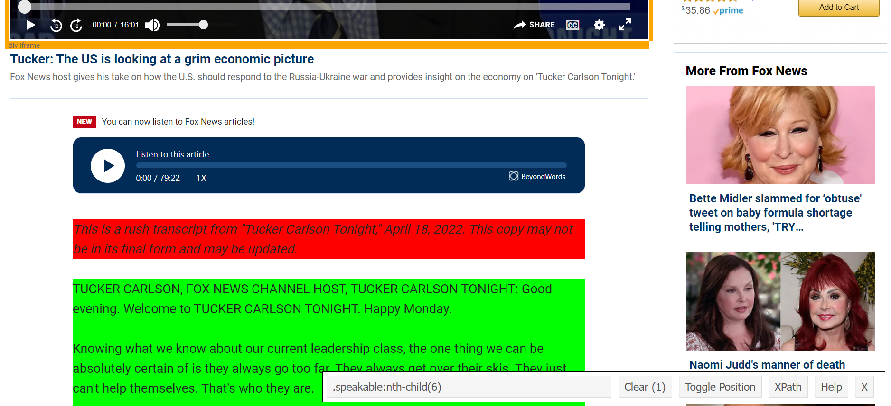

```{r setup, include=FALSE}
knitr::opts_chunk$set(echo = TRUE, warning = FALSE, message = FALSE)
```

The central difficulty we face scraping text data from the web is that web pages are never *just* text. They come with a whole bunch of other junk to make the text look pretty. That junk is written in HTML (Hypertext Markup Language) code, and our first task as researchers is to separate the plain text we want from all the HTML code that's making it look pretty. 

For example, suppose for some reason I wanted to know what Tucker Carlson said on his television program on April 20, 2022. The transcript is [here](https://www.foxnews.com/transcript/tucker-the-us-is-looking-at-a-grim-economic-picture), but it's cluttered. There are graphics, ads, pictures, links to other pages, fonts, and a bunch of other things we don't need for our research. Fortunately, the plain text of the transcript is hiding in the page's HTML code, if we know where to look.

## The `rvest` package

As of writing, the most user-friendly `R` package for getting text data from web pages is [`rvest`](https://rvest.tidyverse.org/index.html) (read that name like "harvest", as in harvesting data).

Let's begin by loading that package.

```{r}
library(tidyverse)
library(rvest)
```

### Reading HTML

To read the HTML from a web page, we can use the `read_html()` function, just like we would read a data file from our computer. Just supply it with the web page's URL.

```{r}
page <- read_html('https://www.foxnews.com/transcript/tucker-the-us-is-looking-at-a-grim-economic-picture')
```

### Getting the Right Elements

Every HTML page is divided into sections by *tags*. If you want to get deep into webscraping, it will be useful to be able to identify some of those tags, because that's how we're going to select which elements from a HTML page we want to keep. 

For instance, there is an HTML tag called `<p>`, which denotes paragraphs of text. To get a list of all elements with the `<p>` tag on this webpage we loaded, we run the following line of code:

```{r}
paragraphs <- page |>
  html_elements('p')

paragraphs
```

This gives us a list with all the raw HTML code. Notice that the 4th entry looks like it has the transcript text we want. To get the plain text from that line of HTML code, we'll use the `html_text()` function.

```{r}
text <- html_text(paragraphs[[4]])

text
```

### SelectorGadget

If you, like me, do not have a deep knowledge of HTML tags and CSS selectors that you can deploy to find the right element on a page, then the [SelectorGadget](https://rvest.tidyverse.org/articles/selectorgadget.html) comes in handy! This is an in-browser tool that was developed alongside the `rvest` package, which allows you to visit the page you're scraping and determine what input to `html_elements()` will get you the section of the page you want. 

```{r, echo = FALSE, fig.cap='Keep the text you want, leave out the Amazon ads and whatever Bette Midler tweeted about the baby formula shortage.'}

```

If we use the SelectorGadget on our webpage here, highlighting the elements we want in green and the elements we *don't* want in red, it tells us to use the selector `.speakable:nth-child(5)`. Here's what that complete pipeline looks like:

```{r}
text <- page |> 
  html_elements('.speakable:nth-child(5)') |> 
  html_text()
  
text
```

## Being Polite

If you plan to use lots of webscraping for your research, it would be wise to brush up on etiquette. Some sites (like Facebook) explicitly ban scraping in their Terms of Service, and even sites that do permit scraping would prefer you didn't overload them with automated requests. You know how people talk about bots destroying the Internet? Well, you've just created a bot, and it's incumbent on you to use it wisely. The [`polite`](https://dmi3kno.github.io/polite/) package is a good place to get started.

## Practice Problems

1. Scrape the transcript from the [Rachel Maddow Show on May 11, 2022](https://www.msnbc.com/transcripts/rachel-maddow-show/transcript-rachel-maddow-show-5-11-22-n1295460).

2. Scrape the text of [Federalist Papers No. 10](https://billofrightsinstitute.org/primary-sources/federalist-no-10).

3. Scrape the text of the [US Congressional Record (Senate - May 16, 2022)](https://www.congress.gov/congressional-record/2022/05/16/senate-section/article/S2509-4).

4. Scrape the text of [The Patient Protection and Affordable Care Act (March 23, 2010)](https://www.congress.gov/bill/111th-congress/house-bill/3590/text).