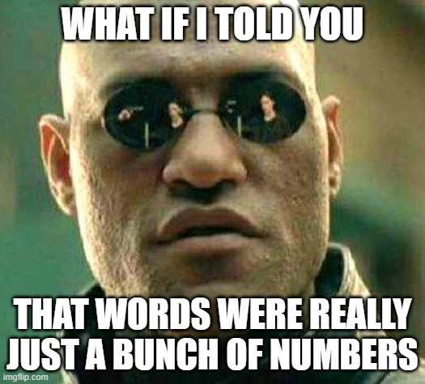

```{r setup, include=FALSE}
knitr::opts_chunk$set(echo = TRUE, warning = FALSE, message = FALSE)
```

```{r, echo = FALSE}

```

Often, we'd like to not only count the frequency of words, but also get a sense of what the words *mean*. In a [bag of words representation](bag-of-words.html), we treat words words like "president" and "executive" as separate indices in a word count vector, implicitly assuming that they have completely unique meanings. But the statistical models we use to understand text data will perform better if words with similar meaning have similar representations. That is the purpose of the word embeddings approach, which represents each word as a vector, encoding the fact that "president" and "executive" have some overlapping meaning by placing their vectors close together.

In this exercise, we'll work with a set of pre-trained word embeddings called [GloVe](https://nlp.stanford.edu/projects/glove/). These off-the-shelf word embeddings tend to do a pretty good job at capturing meaning, even for political science specific applications [@rodriguezWordEmbeddingsWhat2021].[^federalist]

[^federalist]: See `code/03_word-embeddings/federalist-embeddings.R` if you are interested in how to train word embeddings on your own corpus.

```{r}
library(tidyverse)
library(tidytext)
library(text2vec)
```

For expository purposes, let's download the 100-dimensional word embeddings [here](https://nlp.stanford.edu/data/glove.6B.zip). That link downloads a zipped folder called 'glove.6B/'. Unzip it and make sure it is in your 'data/' folder.

```{r}
glove <- read_table("data/glove.6B/glove.6B.100d.txt", 
                    col_names = FALSE)
```

Converting this dataframe to a matrix object makes mathematical operations *much* faster.

```{r}
vocab <- glove$X1

glove <- glove |>
  select(X2:X101) |>
  as.matrix()

rownames(glove) <- vocab
```

It's difficult to visualize and interpret a 100-dimensional vector space, but we can explore which words have similar meaning by looking at their cosine similarity. 

```{r}
# define cosine similarity
cosine_similarity <- function(x1, x2){
  sum(x1*x2) / sqrt(sum(x1^2)) / sqrt(sum(x2^2))
}

cosine_similarity(glove['president',], 
                  glove['executive',])

cosine_similarity(glove['president',], 
                  glove['legislative',])

cosine_similarity(glove['president',], 
                  glove['judicial',])
```

By looking at a word's "nearest neighbors" in GLoVe-space, we can get a sense of its meaning. The following function, adapted from [Emil Hvitfeldt and Julia Silge](https://smltar.com/embeddings.html), performs that computation.

```{r}
nearest_glove_neighbors <- function(word, n = 100){
  sim2(x = glove,
     y = glove[word, , drop = FALSE],
     method = 'cosine',
     norm = 'l2')[,1] |>
  sort(decreasing = TRUE) |>
  head(n)
}
```

What words are most closely associated with the word "democracy"?

```{r, cache = TRUE}
nearest_glove_neighbors('democracy')
```

## Practice Problems

1.  Explore some of the stereotypes reflected in the GloVe embeddings. How close is the word "professor" to female names compared to male names? Hispanic names?
2.  What about words that are ambiguous without context, like "bill" or "share"? What are their nearest neighbors?

## Further Reading

-   @grimmerTextDataNew2021, Chapter 8.

-   [Hvitfeldt & Silge](https://smltar.com/embeddings.html), Chapter 5.
